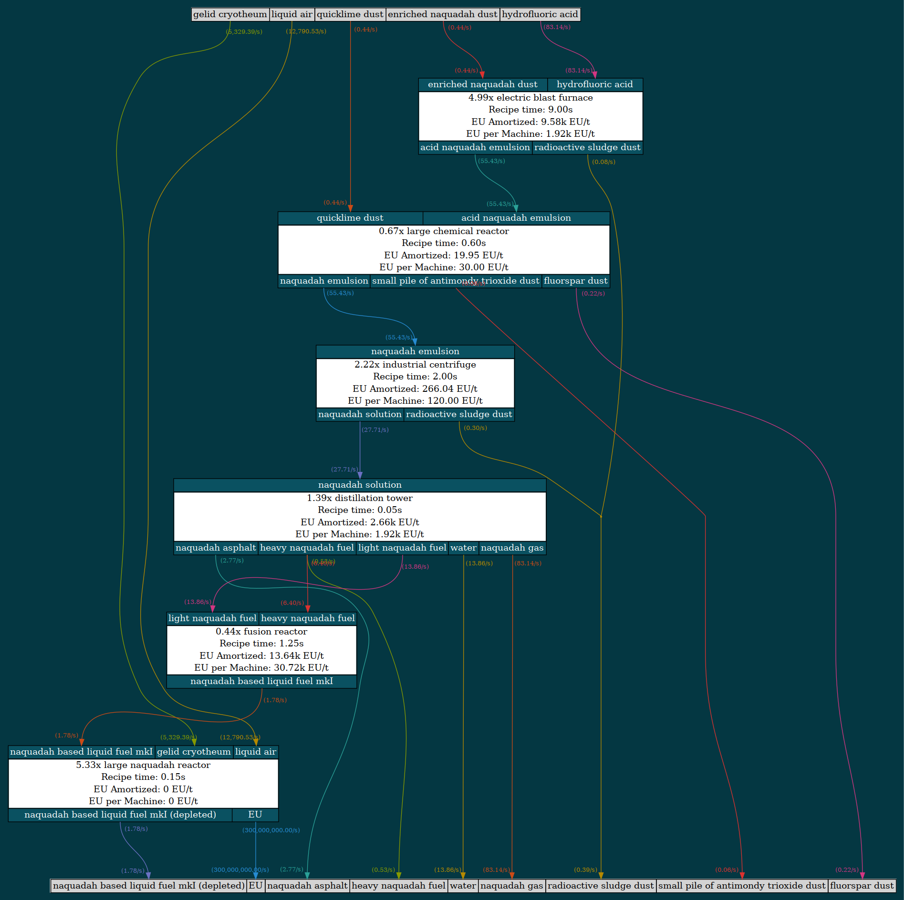

# GTNH Toolkit

> [!Warning]
> This project is very much a work-in-progress. The project does not currently handle machine overclocking or other intricacies. If you decide to use it, please report any bugs, issues, or awkwardness as a GitHub issue.

GTNH Toolkit is a tool for designing factories in the Minecraft modpack GregTech: New Horizons.
It automatically balancing the inputs and outputs of a given set of recipes to
achieve a desired output rate of a given item.

The design is heavily inspired by [gtnh-flow](https://github.com/OrderedSet86/gtnh-flow).



## Usage
I use `uv` for managing dependencies and python environments, so instructions will use `uv` for commands. If you use something else, use the equivalent commands to install dependencies and run the program.

0) Install the Cbc dependency listed in the dependency section of this file. 

1) Write a factory config file that specifies all recipes to be considered as well as your desired item output rate.
Currently, JSON and YAML files are supported.

### Example project file
```yaml
recipes:
  - m: Electrolyzer
    inputs:
      water: 500      # per craft
    outputs:
      oxygen: 500     # per craft
      hydrogen: 1000  # per craft
    dur: 1000         # gameticks per craft
    eut: 100          # EU per gametick

  - m: Large Chemical Reactor
    inputs:
      sulfur: 1               # per craft
      hydrogen: 2000          # per craft
    outputs:
      hydrogen sulfide: 1000  # per craft
    dur: 60                   # gameticks per craft
    eut: 200                  # EU per gametick

targets:
  hydrogen sulfide: 250 # per second
```

3) Run the program with `uv run main.py <factory_config_path>` to generate your output. It will be saved in the `output` folder.

## Dependencies

 - [Cbc](https://github.com/coin-or/Cbc/tree/master)

## Development

### Adding new machine logic

1) Create a new machine recipe class with logic in `gamelogic/machines`.
2) Add normalized machine names to `normalize_machine_name()` in `config_reader.py`
3) Add machine name to machine recipe mapping to `MACHINE_NAME_TO_RECIPE_CLASS` in `config_reader.py`
4) Add recipe creation handling to `initialize_recipe()` in `config_reader.py`
